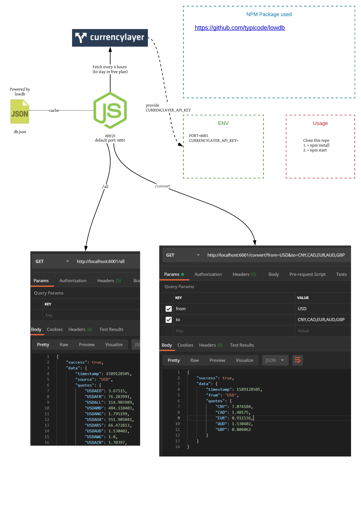

# Getting Started

[Github repo](https://github.com/gjuoun/exchange-api)

[API documentation](https://stoplight.io/p/docs/gh/gjuoun/exchange-api)

## Install

    > git clone https://github.com/gjuoun/exchange-api.git

## Usage

    > npm run build

    > npm start

## Docker Usage

    > docker image build -t exchange-api:1.0 .

    > docker run -d \
      -e PORT=6001 \
      -e CURRENCYLAYER_API_KEY=<Currency_Layer_API_key> \
      -p 6001:6001 \
      exchange-api:1.0

* * *

### API design scratch

